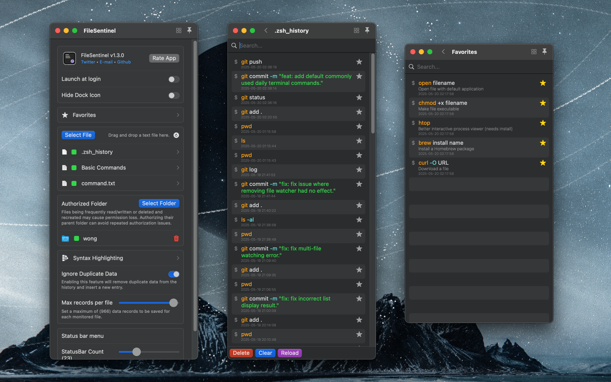

<!--idoc:ignore:start-->
> [!TIP]
> Declaration: This project is not an open-source project. The repository serves as the official website, used to collect issues and user demands. This is done to save costs, because without an official website, the application cannot pass the review.
<!--idoc:ignore:end-->

   
   
  
  <h1>
    FileSentinel
  </h1>
  <!--rehype:style=border: 0;-->
  

    <a href="./README.zh.md">简体中文</a> • 
    <a target="_blank" href="https://github.com/jaywcjlove/file-sentinel/issues/new?template=bug_report.yml">Contact & Support</a> • 
    <a href="https://github.com/jaywcjlove/file-sentinel/releases">Changelog</a>
  

  

    
  

https://github.com/user-attachments/assets/f0b8d5a6-87f3-4066-a587-d987ee968317?title=FileSentinel&rehype=video

File Monitor for listening to text files and saving the last line of content. It can monitor files like `.zsh_history` or `.bash_history`, automatically saving shell history, helping you easily search recent terminal commands and ensuring you never forget any command again. No need to open the terminal; quickly access your command history, with full-text search support, making it easier and faster to query historical records.

## Features

- Command Search: Quickly find the command you need.
- Pin Commands: Save frequently used commands for quick access.
- Menu Bar Access: Access command history directly from the menu bar for seamless integration.
- Automatic Deduplication: Listens and automatically removes duplicate command records.
- Import History Records: Import existing shell history before listening.

FileSentinel is a tool for monitoring text file changes, leveraging macOS’s generated .zsh_history file to track terminal commands. It supports all popular shells: zsh (default on macOS), bash, and fish shell, and also allows you to import other history files.

Whether for debugging, recalling complex commands, or improving work efficiency, FileSentinel is your go-to solution for easily navigating your terminal command history.
