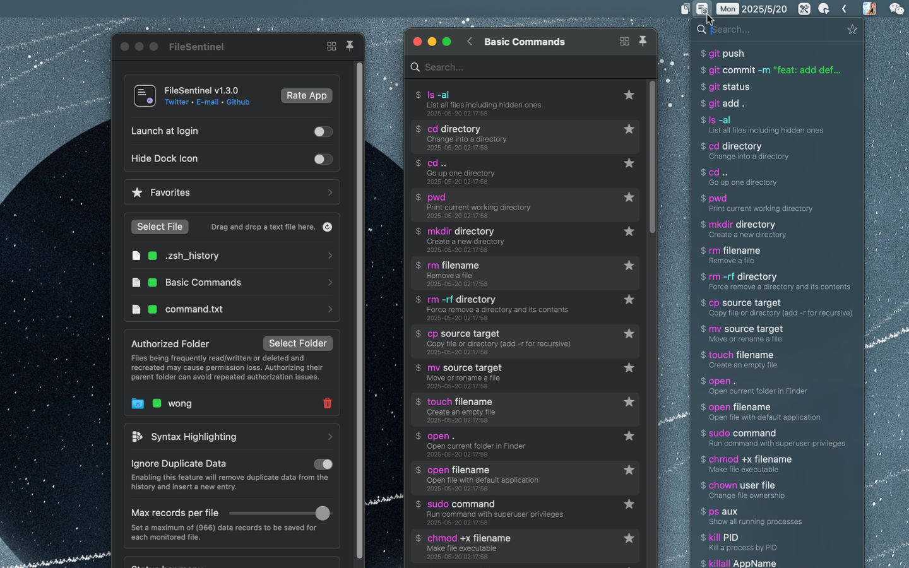

<!--idoc:ignore:start-->
> [!TIP]
> 声明：此项目并非开源项目，仓库作为官方网站，用于收集问题和用户需求。这样做是为了节省成本，因为没有官网，应用无法通过审核。
<!--idoc:ignore:end-->

   
   
  
  <h1>
    FileSentinel
  </h1>
  <!--rehype:style=border: 0;-->
  

    <a href="./README.md">English</a> • 
    <a target="_blank" href="https://github.com/jaywcjlove/file-sentinel/issues/new?template=bug_report_cn.yml">联系&支持</a> • 
    <a href="https://github.com/jaywcjlove/file-sentinel/releases">变更日志</a>
  

  

    
  

文件监视器，用于监听文本文件并保存最后一行内容。它可以监控类似 `.zsh_history` 或 `.bash_history` 的文件，自动保存 Shell 历史记录，帮助你轻松搜索最近的终端命令，确保你再也不会忘记任何命令。无需打开终端，便可快速访问命令历史，支持全文搜索，让查询历史记录变得更加方便快捷。

## 主要功能

- 命令搜索：快速查找你需要的命令。
- 收藏命令：保存常用命令，便于快速访问。
- 菜单栏访问：直接从菜单栏访问命令历史，轻松集成。
- 自动去重：监听并自动去除重复的命令记录。
- 导入历史记录：在监听前导入现有的 Shell 历史记录。

FileSentinel 是一款用于监听文本变化的工具，利用 macOS 生成的 .zsh_history 文件来追踪终端命令。它支持所有流行的 Shell：zsh（macOS 默认）、bash 和 fish shell，还允许你自行导入其他历史记录文件。

无论是调试、回顾复杂命令，还是提高工作效率，FileSentinel 都是你轻松浏览终端历史记录的最佳选择。